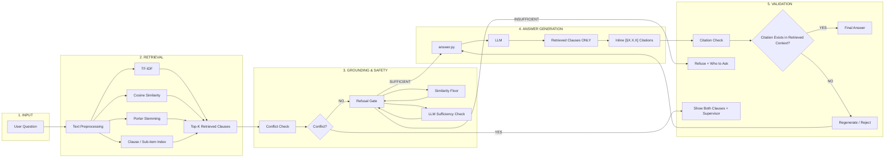

# The Grounded Answer
An assistant that answers policy questions from the Calder County Household
Support Program manual, cites the exact clause it used, refuses when the
manual doesn't settle the question, and flags it explicitly when the
manual contradicts itself.

Includes a full before/after comparison against Amendment No. 2026-01,
kept as two entirely separate pipelines so neither corpus ever overwrites
the other.

---
## System Architecture




Retrieval is plain TF-IDF + cosine similarity computed in memory with
scikit-learn -- no vector database, no persistent index, no server.

## Setup

1. Install Ollama: https://ollama.com, then `ollama pull llama3.1:8b`
2. Install Python dependencies: `pip install -r requirements.txt`

## Running the main submission

```bash
python src/chunk.py
python src/retriever.py
python src/cli.py "What is the resource limit for a household to remain eligible?"
python tests/run_tests.py > tests/RESULTS.txt
```

## Running the before/after amendment comparison

```bash
python src/chunk_before.py
python src/chunk_after.py
python tests/run_before_after.py
```

Writes `tests/amendment_results_before.txt` and `tests/amendment_results_after.txt`.

## Known limitations

- TF-IDF is lexical, not semantic — weaker on heavily paraphrased questions.
- No date-aware reasoning — Amendment 2026-01's transitional provision requires comparing dates, which this pipeline doesn't handle.

## Clone this repo

```bash
git clone https://github.com/Shre-30/Brite-Spark-2026-Hackathon---Use-Case-1.git
cd Brite-Spark-2026-Hackathon---Use-Case-1
```
